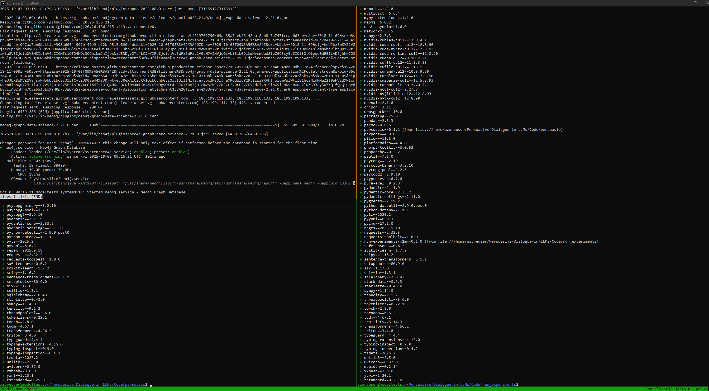
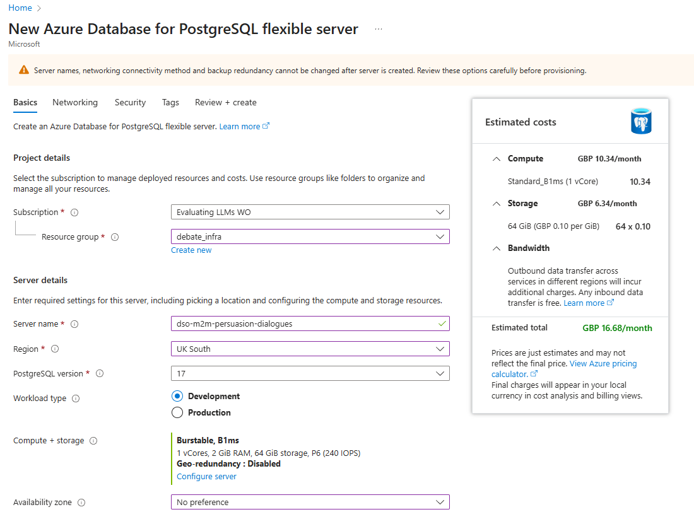
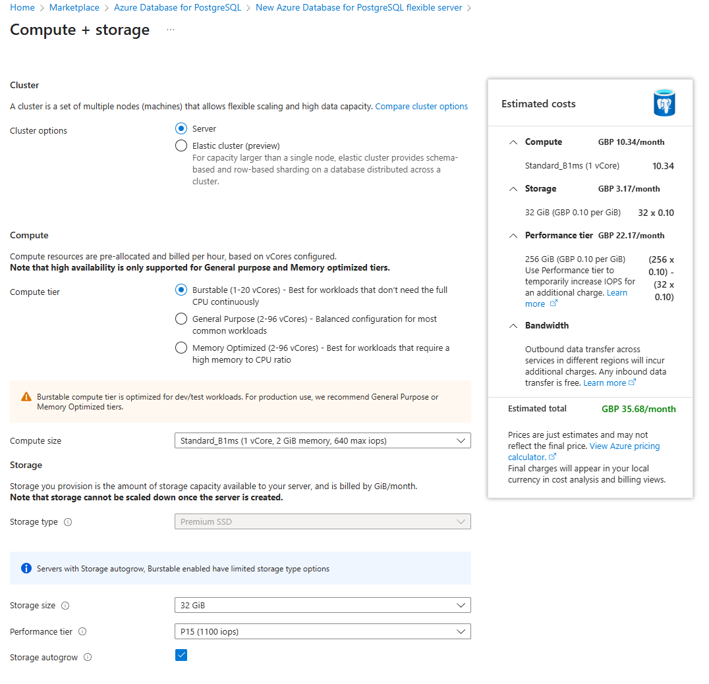
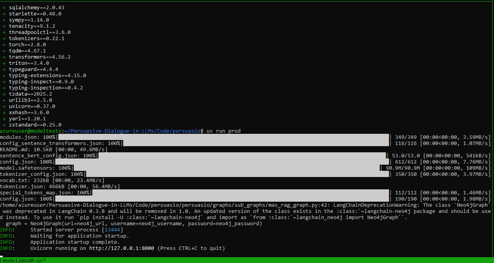
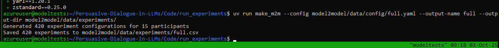
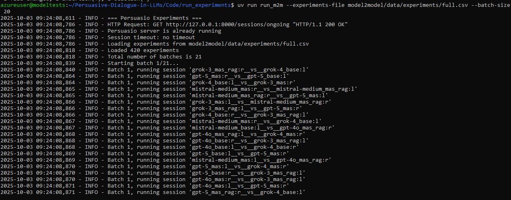

# Model--Model Azure VM Deployment

This `README` documents the setup, configuration, and execution of model--model experiments designed to study persuasive dialogues in LLMs.  

# Table of Contents

- [1. Model-vs-Model Experiments](#1-model-vs-model-experiments)

  - [1.1. Deploy an MS Azure Virtual Machine (VM)](#11-deploy-an-ms-azure-virtual-machine-vm)

    - [1.1.1. Deploy Through The Azure Portal](#111-deploy-through-the-azure-portal)

    - [1.1.2. Deploy Through The Azure Command Line Interface (CLI)](#112-deploy-through-the-azure-command-line-interface-cli)

  - [1.2. VM Setup](#12-vm-setup)

    - [1.2.1. SSH into VM](#121-ssh-into-vm)

    - [1.2.2. Download GitHub CLI Tools](#122-download-github-cli-tools)

    - [1.2.3. Login To GitHub](#123-login-to-github)

    - [1.2.4. Download Our Repo](#124-download-our-repo)

  - [1.3. Scripts](#13-scripts)

  - [1.4. PostgreSQL Setup](#14-postgresql-setup)

  - [1.5. Running Experiments](#15-running-experiments)

  - [1.6. Models](#16-models)

  - [1.7. Persuasio Parameters](#17-persuasio-parameters)

  - [1.8. Model-vs-Model Results](#18-model-vs-model-results)

- [2. Human-vs-Model Experiments](#2-human-vs-model-experiments)


# 1. Model-vs-Model Experiments

This file documents how to set up the experiments for model-vs-model tests. Three things need to be set up, namely the:

1. Persuasio server;
2. Class to run experiments;
3. Neo4j knowledge base for Retrieval Augmented Generation (RAG).

## 1.1. Deploy an MS Azure Virtual Machine (VM)

There are two methods for creating a VM on Azure, which will be explained below. 

### 1.1.1. Deploy Through The Azure Portal

You can deploy a VM through Azure's Portal by following the instructions in this [link](https://learn.microsoft.com/en-us/azure/virtual-machines/linux/quick-create-portal?tabs=ubuntu).

### 1.1.2. Deploy Through The Azure Command Line Interface (CLI)

> [!NOTE]  
> This is the method used to deploy the VM for model-vs-model experiments.

Download Azure CLI [here](https://learn.microsoft.com/en-us/cli/azure/install-azure-cli?view=azure-cli-latest).

Open a terminal or command prompt (Unix or Windows) and execute the following command:

```bash copy
az interactive
```

You now need to create a resource group, called `model2model` in this work.

Then, deploy a VM using the command below:

```bash copy
az vm create --resource-group model2model --name model_tests --image Ubuntu2404 --generate-ssh-keys --verbose --admin-username azureuser --output json --size Standard_D32as_v5
```

| **Term**                       | **Meaning**                                                                                                                                 |
| ------------------------------ | ------------------------------------------------------------------------------------------------------------------------------------------- |
| `az`                           | The Azure CLI tool for managing Azure resources.                                                                   |
| `vm`                           | A sub-command in Azure CLI that manages VMs.                                                                              |
| `create`                       | The action to perform: creating a new virtual machine.                                                                                      |
| `--resource-group model2model` | Specifies the **resource group** (`model2model`) where the VM will be created. A resource group is a logical container for Azure resources. |
| `--name model_tests`           | Assigns the VM the name **`model_tests`**.                                                                                                  |
| `--image Ubuntu2404`           | Defines the operating system image to use for the VM; here it is **Ubuntu Server 24.04 LTS**.                                               |
| `--generate-ssh-keys`          | Generates a new pair of SSH keys if none already exist, used for secure login to the VM.                                                    |
| `--verbose`                    | Increases the level of detail shown in the command output (helpful for debugging or confirmation).                                          |
| `--admin-username azureuser`   | Sets the administrator (login) username to **`azureuser`**.                                                                                 |
| `--output json`                | Specifies the output format of the command; here it is **JSON**. Alternatives include `table`, `yaml`, `tsv`, etc.                          |
| `--size Standard_D32as_v5`       | Defines the VM size. **`Standard_D32as_v5`** means 32 vCPUs (64 core and 128 threads), 128 GB RAM, optimised for general-purpose workloads. This costs £870.89/month.                           |


Response should look something like this:

```bash
{
  "fqdns": "",
  "id": "/subscriptions/<subscription-id>/resourceGroups/model2model/providers/Microsoft.Compute/virtualMachines/model_tests",
  "location": "ukwest",
  "macAddress": "<mac-address>",
  "powerState": "VM running",
  "privateIpAddress": "<private-ip-address>",
  "publicIpAddress": "<public-ip-address>",
  "resourceGroup": "model2model"
}
```

> [!IMPORTANT] 
> To delete the VM from the using Azure CLI, run:
> ```bash copy
> az vm delete --resource-group model2model --name model_tests --yes
> ```


## 1.2. VM Setup

Once the VM is running, you can login and set it up ready for the experiments.

### 1.2.1. SSH into VM

```bash copy
ssh -i ~/.ssh/id_rsa azureuser@<public-ip-address>
```

It is good practice to ensure all packages are up-to-date before installing subsequent dependencies. Run:

```bash copy
sudo apt-get update
```


### 1.2.2. Download GitHub CLI Tools

Now that the VM's packages have been updated, we must download GitHub (GH) command line tools so that we can log in using the commands below:

```bash copy
curl -fsSL https://cli.github.com/packages/githubcli-archive-keyring.gpg | sudo dd of=/usr/share/keyrings/githubcli-archive-keyring.gpg && sudo chmod go+r /usr/share/keyrings/githubcli-archive-keyring.gpg && echo "deb [arch=$(dpkg --print-architecture) signed-by=/usr/share/keyrings/githubcli-archive-keyring.gpg] https://cli.github.com/packages stable main" | sudo tee /etc/apt/sources.list.d/github-cli.list > /dev/null && sudo apt-get update && sudo apt-get install gh -y
```

### 1.2.3. Login To GitHub

```bash copy
gh auth login
```

### 1.2.4. Download Our Repo

```bash copy
git clone https://github.com/RobinsonJI/Evaluating-the-Capabilities-of-LLMs-for-Persuasive-Dialogue.git
```

```bash copy
cd Evaluating-the-Capabilities-of-LLMs-for-Persuasive-Dialogue/ && git checkout -b m2m_experiments && cd ..
```

## 1.3. Scripts

Download the prerequisites:

```bash copy
source model2model_experiments/scripts/azure-uv-tmux-c-psql-python-setup.sh
```

Set up the session terminals:

```bash copy
source model2model_experiments/scripts/scripts/tmux-session-setup.sh
```

Once the `Persuasio` server, `run_experiments` class, and `Neo4j Community server` are set up, your terminal should look like the figure below.



> [!IMPORTANT]
> [Tmux](https://github.com/tmux/tmux/wiki) is a terminal multiplexer that allows you to view multiple terminals (each wither their own distinct processes) within one terminal. The windows in the above figure are:
>
> - The status of the Neo4j Community server (top left);
> - The directory from which to run `Persuasio` (bottom left);
> - The directory from which to execute the `run_experiments` class (right).
>
> You change to a different `tmux` window by pressing `Crtl+B` and then pressing an arrow key. Then, you can run a command in the chosen terminal window.

## 1.4. PostgreSQL Setup

1. Login to the [MS Azure Portal](https://portal.azure.com/#view/Microsoft_Azure_Marketplace/MarketplaceOffersBlade/selectedMenuItemId/home), go to the `Marketplace`, search for `PostgreSQL` and click `Create` on the `Azure Database for PostgreSQL` by `Microsoft | Azure Service`.

2. Set the subscription to your Azure subscription and create a resource group.

2. Set the server name, region, PostgreSQL version to `17`, and workload type to `Development`.



3. Click `Configure server` and set the server up with your settings. You can use the image below to configure your settings to the ones we used (it should cost around £35.68/month).



4. Set up authentication so that Persuasio can commit to and read from the PostgreSQL database. We used `PostgreSQL authentication only`.

> [!NOTE]
> Set a strong username and password for the database and store them securely. Configure the credentials in your `.env` file (see the [Persuasio README](../../persuasio/README.md) for details).

5. Now click `Review + create`, then `Create`, then `Create server without firewall rules`, and the PostgreSQL database will be set up.

6. The final task is to change the database's firewall settings to allow inbound IP addresses from any Azure service. We can do this because the entirety of our system is deployed on MS Azure systems and services only. Go to `MS Azure Home` -> `All resources` -> your PostgreSQL server -> `Settings` -> `Networking` -> click/tick `Allow public access from any Azure service within Azure to this server` -> press `Save` (see figure below for guidance). 


> [!NOTE]
> You can set the firewall to allow all inbound, public IP addresses. However, this approach is not recommended as it is not as secure.


## 1.5. Running Experiments

After the Neo4j Community server is running and the PostgreSQL is running, you are ready to run the experiments.

### 1.5.1. Persuasio Server

To run the `Persuasio` server:

1. Change to `tmux` window with this directory: `~/Evaluating-the-Capabilities-of-LLMs-for-Persuasive-Dialogue/Code/persuasio`.

2. Run: `uv run prod`.

The `Persuasio` tmux window should look like the following.



### 1.5.2. `run_experiments` Class

1. Change `tmux` window with this directory: `~/Evaluating-the-Capabilities-of-LLMs-for-Persuasive-Dialogue/Code/run_experiments`.

2. Run `uv run make_m2m --config model2model/data/config/full.yaml --output-name full --output-dir model2model/data/experiments/ --output-format csv` to create the experiments.



3. Run `uv run run_m2m --experiments-file model2model/data/experiments/full.csv` to run the model-vs-model tests.




## 1.6. Models 

The models included in the tests as of 29th September were:

| **Model**                      | **Model Name** | **Temperature** | **top_p** | **Seed** | **Publisher** | **Hosted On** |
| ------------------------------ | -------------- | --------------- | --------- | -------- | ------------- | ------------- |
| GPT 5 (Not used as too slow)                    |      `gpt-5-chat`     |        NA       |    NA     |    123   |   OpenAI      |    Azure      |
| GPT 4o mini                           | `gpt-4o-mini` | 0 | 1.0 | 123 | OpenAI | Azure |
| OpenAI's GPT 4o              |      `gpt-4o`     |        NA       |    NA     |    123   |   OpenAI      |    Azure      |              
| Grok 3                       |      `grok-3`     |        0        |    1.0    |    123   |   xAI         |    Azure      |      
| Grok 4         | `grok-4-fast-no-reasoning` |        0        |    1.0    |    123   |   xAI         |    Azure      |
| Mistral Medium        | `mistral-medium-2505` |        0        |    1.0    |    123   | MistralAI     | Azure         |


> [!NOTE]
> Experiments the following models were not included in subsequent human--model experiments and analysis:
>
> - GPT 5, as the was too slow and costly;
> - Grok 4, as the model was observed to be incapable of reliably producing structured outputs. We spoke with MS Azure support but they could not fix the problem in time for experiments so the model was ommitted.
> - GPT 4o mini, as the model could not reliably produce structured outputs.

## 1.7. Persuasio Parameters

Parameters are shown below and can be found [here](../model2model/data/config/full_m2m_experiments.yaml).

```yaml
repetitions: 1

models:
  - "mistral-medium"
  - "gpt-4o"
  - "grok-3"

model_types:
  - "base"
  - "mas"
  - "mas_rag"

max_dialogue_turns: 40
max_sentences_per_turn: 5

first_speaker_model_temp: 0
first_speaker_model_top_p: 1.0
first_speaker_model_seed: 123
first_speaker_political_position_std: 10
first_speaker_political_position_prob_of_na: 0.25
first_speaker_number_of_vector_based_rag_examples: 100
first_speaker_number_of_graph_rag_examples: 5

second_speaker_model_temp: 0
second_speaker_model_top_p: 1.0
second_speaker_model_seed: 123
second_speaker_political_position_std: 10
second_speaker_political_position_prob_of_na: 0.25
second_speaker_number_of_vector_based_rag_examples: 100
second_speaker_number_of_graph_rag_examples: 5

utterance_classification_approach: "single-classification"
```