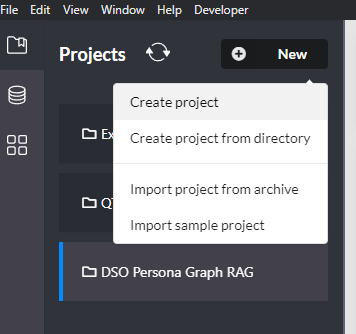
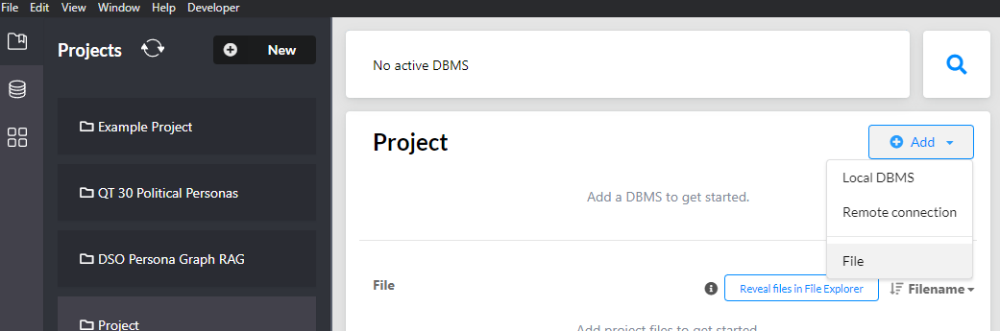
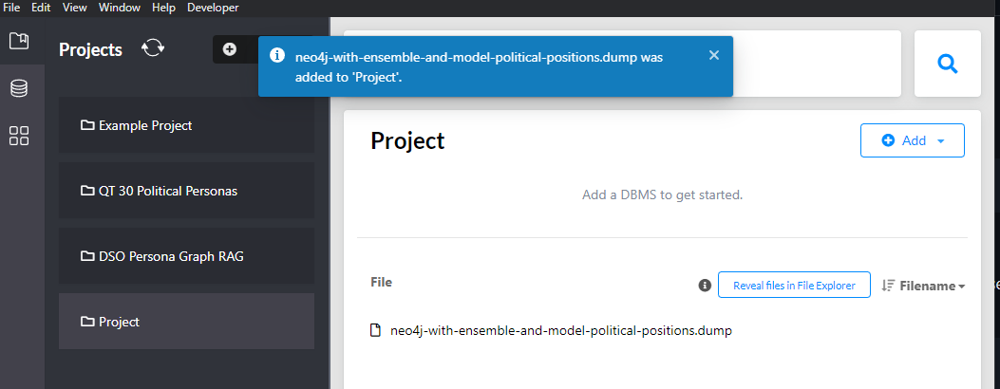
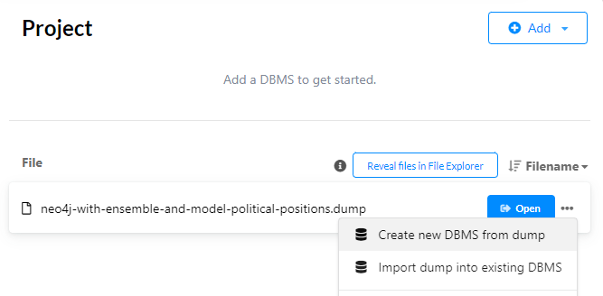
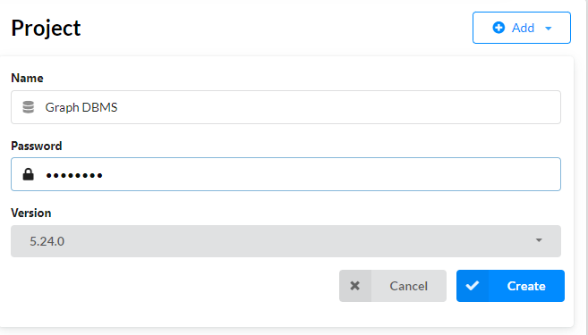
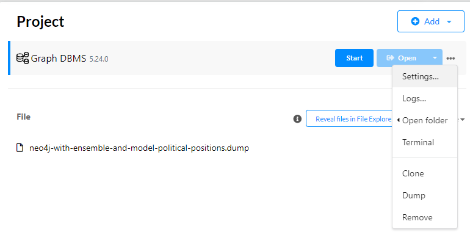
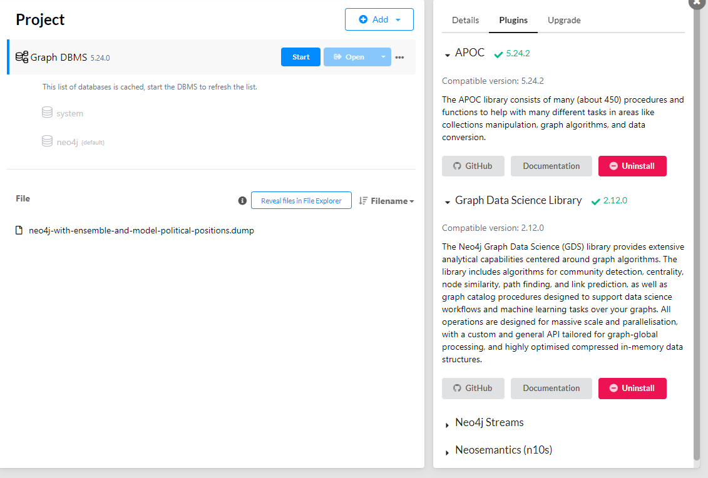

# Setting up the Knowledge Base (Neo4j)

To use Persuasio's Graph RAG system, you must set up the Neo4j knowledge base. The knowledge base is built on the argumentation graph from [Robinson et al. (2026)](https://arxiv.org/pdf/2602.18351), which provides a structured representation of arguments, with predicted political positions, and their relationships for use in retrieval-augmented generation.

Three installation methods are provided below.

## 1. Docker (Recommended)

The simplest way to get started is using the provided [`Dockerfile.neo4j`](../../Dockerfile.neo4j), which pre-loads the knowledge base dump and configures memory and plugins automatically.

### Build and Run

```bash
docker build -f Dockerfile.neo4j -t persuasio-neo4j .
docker run -p 7474:7474 -p 7687:7687 \
  -e NEO4J_AUTH=neo4j/your-neo4j-password \
  persuasio-neo4j
```

| Port | Service |
|------|---------|
| `7474` | Neo4j Browser (`http://localhost:7474`) |
| `7687` | Bolt protocol (`bolt://localhost:7687`) |

> [!NOTE]
> Make sure the knowledge base dump has been downloaded via Git LFS before building:
> ```bash
> git lfs pull
> ```

## 2. Neo4j Desktop (Windows, Mac, Unix)

A step-by-step guide for installing and setting up the knowledge base using Neo4j Desktop.

### 2.1. Install Neo4j

1. Download [Neo4j Desktop](https://neo4j.com/download/).
2. Create an account and link it to your desktop application.

### 2.2. Load the Knowledge Base Dump

1. Create a new project:



2. Click `Add` → `File`:



3. Download the prepared knowledge base dump: [neo4j.dump](knowledge_base/neo4j.dump).

> [!NOTE]
> Make sure you download the `.dump` file using Git Large File Storage (LFS), i.e. `git lfs pull`.

4. Click `Open` and then your `.dump` file should be loaded within the Neo4j browser.



5. Click the `...` (more options) button and select `Create new DBMS from dump`.



6. Enter a password for the database. Ensure it matches the `NEO4J_PASSWORD` value in your `.env` file (see the [Persuasio README](../../README.md) for details).



7. Click `Create`.

### 2.3. Neo4j Memory Configuration

Neo4j requires increased memory allocation for Persuasio's knowledge base.

1. Open the `neo4j.conf` file via: `...` → `Settings`.



2. Remove these default settings (if present):

   ~~dbms.memory.heap.initial_size=512m~~

   ~~dbms.memory.heap.max_size=1G~~

   ~~dbms.memory.pagecache.size=512m~~

3. Replace them with:

```
dbms.memory.heap.initial_size=1g
dbms.memory.heap.max_size=4g
dbms.memory.pagecache.size=8g
```

### 2.4. Install Plugins

Install the prerequisite plugins --- `APOC` and `Graph Data Science Library` --- for the knowledge base to work (see picture below).



Now everything should be set up and ready for you to run Persuasio's knowledge base.

## 3. Linux Server (Ubuntu Server 24.04 LTS)

To set up Neo4j Community on a Linux VM server, run the provided setup script:

```bash
source ../../../model2model_experiments/scripts/azure-neo4j-setup.sh
```

> [!NOTE]
> Running the above command will install a **local** Neo4j Community instance on your Linux server, update the configuration files, and install the required plugins.
>
> The default credentials are:
> - **Username:** `neo4j`
> - **Password:** Set during installation --- update the `NEO4J_PASSWORD` value in your `.env` file accordingly.
>
> To expose the server on a public-facing IP address, uncomment the following line in the setup script:
>
> ```bash
> sudo sed -i 's/^#*\s*server.default_listen_address=.*/server.default_listen_address=0.0.0.0/' /etc/neo4j/neo4j.conf
> ```

> [!IMPORTANT]
> Neo4j Community requires `.dump` files in `aligned` format. Neo4j Desktop saves `.dump` files in `block` format, which will not work with a Neo4j Community instance on Ubuntu. To convert the format, follow the instructions in [knowledge_base/converting-dump-files-from-block-format-to-aligned.pdf](knowledge_base/converting-dump-files-from-block-format-to-aligned.pdf).